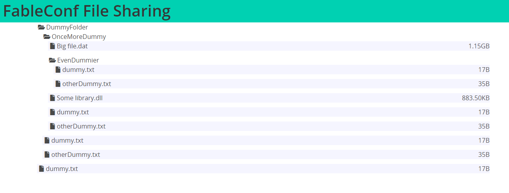

# Remove Server/Client Boundaries with Elmish.Bridge

The Elm architecture lets you think about your program like a conversation.

When you click a button, you tell your update function that "Hey! I just clicked that button. What can you give me for that?" and based on the current model and that message, you get a new model that will reflect in a new view, where you can push another button and have a pleasant talk.

But when you had to talk to your server, it was like having a foreign concept. You weren't just telling "I pressed a button! Show me something new", you were asking "Give me that resource that is on endpoint xyz via the GET method". All the magic of having a state where a new message brings you another state is lost.

So Elmish.Bridge came to the rescue of bringing you back to the pit of success. Don't worry if you should be PUTting or POSTing that data. Just tell "Server! Save that data for me, please?" and if you want you can answer it with "It's saved, my friend! I gave it an id of 345.". The server will communicate with the client with the same messages that you are already comfortable with.

---

## Why would I need Bridge? When it shines?

Bridge was born with a narrower use in mind. The idea was to keep a single model in both client and server, having some messages being handled by the former and the remaining by the latter. It was supposed to only act as a thin interface between a frontend with Fable and a backend with full .NET support.

For the most part, that is how it's best used. It opens new possibilities for libraries that weren't made with Fable in mind. Now you can make some pretty tool with a cool CSS face that can talk with the thousands of packages that NuGet and npm offers.

But besides that, you can now have an Elmish program that runs on the server with full system access. Exploiting that feature, for today we will make an interface for editing files on a server folder.

## Table of contents

The repository is tagged on some levels:

- [Creating the project](https://github.com/Nhowka/FableConfFS/releases/tag/01-starting-out-safe)
- [Initial modeling](https://github.com/Nhowka/FableConfFS/releases/tag/02-initial-modelling)
- [Sync the client and server in real-time](https://github.com/Nhowka/FableConfFS/releases/tag/03-real-time-sync)
- [Uploading and downloading files](https://github.com/Nhowka/FableConfFS/releases/tag/04-upload-and-download)
- [Deploying](https://github.com/Nhowka/FableConfFS/releases/tag/05-deploy)

## Starting out safe

Since version 1.8.0 you can use [SAFE-Template](https://safe-stack.github.io/docs/quickstart/) to create a new project with all you need to start using Elmish.Bridge. This very repository had its first commit with the code you get by typing:

```
dotnet new SAFE -o FableConfFS --communication bridge --deploy heroku
```

Heroku is a nice playground for testing your project online, with less websocket restrictions on a free application and available on SAFE-Tempate since version 1.3.0. Make sure you installed all the pre-requisites and start the little template by opening the `FableConfFS` folder and typing on the console:

```
fake build -t run
```

## Modelling the basics

As we want to share a folder, let's start simple and show that folder contents. For that we will need a folder and a way to represent said folder. For representing the contents we can make a simple union with cases for files and directories:

```fs
// Shared/Shared.fs
type FileItem =
    | Directory of {| FullPath: string; Children: FileItem list |}
    | File of {| FullPath: string; Size: int |}

type ServerMsg = unit

type ClientMsg = LoadRoot of FileItem list
```

We won't send anything to the server at the moment, so we use `unit` as a placeholder for `ServerMsg` and `LoadRoot of FileItem list` for `ClientMsg`. Now we can make the server load the folder when the client connects:

```fs
// Server/Server.fs
type Msg = Remote of ServerMsg

type Model =
    { BaseFolder: DirectoryInfo }

let removeBase (baseFolder: string) (fullName: string) =
    if fullName.StartsWith baseFolder then fullName.[baseFolder.Length..]
    else fullName

let rec readFolder baseFolder folder =
    let di = DirectoryInfo folder
    let files =
        di.GetFiles() |> Array.map (fun e -> File
                                                 {| FullPath = e.FullName |> removeBase baseFolder
                                                    Size = int e.Length |})
    let dirs =
        di.GetDirectories() |> Array.map (fun d -> Directory
                                                       {| FullPath = d.FullName |> removeBase baseFolder
                                                          Children = readFolder baseFolder d.FullName |})
    Array.append files dirs
    |> Array.sortBy (function
        | File f -> f.FullPath
        | Directory d -> d.FullPath)
    |> Array.toList

let init clientDispatch baseFolder =
    let di = DirectoryInfo baseFolder
    if not di.Exists then di.Create()
    let contents = readFolder di.FullName di.FullName
    clientDispatch (LoadRoot contents)
    { BaseFolder = di }, Cmd.none

let update clientDispatch msg model =
    match msg with
    | Remote() -> failwith "Still not needed"
```

For our messages, we create yet another placeholder. Our model will keep the `DirectoryInfo` of the root folder.

We have a helper function `removeBase` so we don't leak the real location where our files are. The function `readFolder` takes that root folder and the current folder that will read all files and all directories recursively.

The `init` is where we will send the initial state of our shared folder. We create the folder if it not exists and then sends its contents for the client using the `clientDispatch` function and `update` won't be needed right now.

Now we will show that folder content on the client:

```fs
// Client/Client.fs

type Model =
    { Contents: FileItem list option }

type Msg = Remote of ClientMsg

let init(): Model * Cmd<Msg> = { Contents = None }, Cmd.none

let update (msg: Msg) (currentModel: Model): Model * Cmd<Msg> =
    match currentModel.Contents, msg with
    | _, Remote(LoadRoot root) -> { currentModel with Contents = Some root }, Cmd.none

let sizeFormatter =
    let sizes = [ "KB"; "MB"; "GB" ]
    fun n ->
        if n > 1024 then
            let rec formatter sizes n =
                match sizes with
                | current :: remaining ->
                    if n > 1024. then formatter remaining (n / 1024.)
                    else sprintf "%0.2f%s" n current
                | [] -> "Big"
            formatter sizes ((float n) / 1024.)
        else sprintf "%iB" n

let rec makeTree (baseFolder: string) dispatch =
    function
    | File f ->
        Field.div
            [ Field.HasAddons
              Field.Props [ Style [ Background "#f5f5ff" ] ] ]
            [ Control.p [] [ Icon.icon [] [ Fa.i [ Fa.Solid.File ] [] ] ]

              Control.p [ Control.IsExpanded ] [ span [] [ str f.FullPath.[baseFolder.Length + 1..] ] ]
              Control.p [] [ str (sizeFormatter f.Size) ] ]
    | Directory d ->
        Field.div []
            [ Control.div []
                  [ span []
                        [ Control.p []
                              [ Icon.icon [] [ Fa.i [ Fa.Solid.FolderOpen ] [] ]
                                str d.FullPath.[baseFolder.Length + 1..] ] ] ]

              Control.div [ Control.IsExpanded ]
                  [ Field.div [ Field.HasAddons ]
                        [ Control.p [ Control.Props [ Style [ Width "15px" ] ] ] []

                          Control.div [ Control.IsExpanded ] (d.Children |> List.map (makeTree d.FullPath dispatch)) ] ] ]

let view (model: Model) (dispatch: Msg -> unit) =
    div []
        [ Navbar.navbar [ Navbar.Color IsPrimary ]
              [ Navbar.Item.div [] [ Heading.h2 [] [ str "FableConf File Sharing" ] ] ]

          Container.container []
              (match model.Contents with
               | None -> [ str "Shared folder is being loaded" ]
               | Some content -> content |> List.map (makeTree "" dispatch)) ]

```

For our client we have now a simple model that takes the optional root content that is empty when `init`ially loaded until the server sends it. Once it has come through, the `update` function takes care of getting the content and changing the model with the new content.
The function `sizeFormatter` only makes the file size prettier, `makeTree` creates a simple recursive tree with the contents like the following:



Add some new files to your folder, refresh the page and you shall see the added files on the next start.

## Syncing the folder

Needing to refresh the page to have the new files appear seems wasteful. We have a tool that can make the server send messages without needing requests, so we will use that to send modifications to all connected clients when they happen.

For that, we will introduce 2 pieces.
- `FileSystemWatcher` is a .NET class that has tools to watch a folder for modification, exactly what we need.
- `ServerHub` is an Elmish.Bridge bag of connections. It keeps a reference for all models and dispatch functions from connected clients.

With both, we can mirror our shared folder at the moment that everything is created.

Let's declare the new messages that we will receive:

```fs
// Shared/Shared.fs

type ClientMsg =
    | LoadRoot of FileItem list
    | FileRenamed of {| OldName: string; NewName: string |}
    | FileChanged of {| FullPath: string; Size: int |}
    | FileCreated of {| FullPath: string; Size: int |}
    | FolderCreated of string
    | FileDeleted of string
```

For `FileRenamed` we just need the old and new name. For `FileChanged` and `FileCreated` we use the same definition we have for `FileItem.File` so we can have a better time. For the `FolderCreated` we just take the new path and for `FileDeleted` the former path. Let's send them from the server:

```fs
// Server/Server.fs

type Msg =
    | Remote of ServerMsg
    | ChangedEvent of FileSystemEventArgs
    | RenamedEvent of RenamedEventArgs
    | Error of exn

let serverHub = ServerHub()

[<System.Security.Permissions.PermissionSet(System.Security.Permissions.SecurityAction.Demand, Name = "FullTrust")>]
let watcher root =
    let watcher = new FileSystemWatcher()
    watcher.Path <- root
    watcher.Filter <- "**"
    watcher.NotifyFilter <-
        NotifyFilters.Size
        ||| NotifyFilters.FileName
        ||| NotifyFilters.DirectoryName
    watcher.IncludeSubdirectories <- true
    let changes _ e = serverHub.BroadcastServer(ChangedEvent e)
    let renamed _ e = serverHub.BroadcastServer(RenamedEvent e)
    watcher.Changed.AddHandler(FileSystemEventHandler changes)
    watcher.Created.AddHandler(FileSystemEventHandler changes)
    watcher.Deleted.AddHandler(FileSystemEventHandler changes)
    watcher.Renamed.AddHandler(RenamedEventHandler renamed)
    watcher.EnableRaisingEvents <- true

let update clientDispatch msg model =
  try
    match msg with
    | Error ex ->
        eprintfn "%A" ex
        model, Cmd.none
    | ChangedEvent fc ->
        let removeBase' = removeBase model.BaseFolder.FullName
        match fc.ChangeType with
        | WatcherChangeTypes.Created ->
            let file = FileInfo(fc.FullPath)
            if file.Exists then
              clientDispatch
                (FileCreated
                    {| FullPath = fc.FullPath |> removeBase'
                       Size = int file.Length |})
            else
              let d = {|FullPath = fc.FullPath |> removeBase'; Children =  readFolder model.BaseFolder.FullName fc.FullPath|}
              let rec inner (dir:{| FullPath: string; Children: FileItem list |})  =
                clientDispatch
                    (dir.FullPath |> removeBase' |> FolderCreated )
                dir.Children |> List.iter (function Directory d -> inner d | File f -> clientDispatch (FileCreated f))
              inner d
        | WatcherChangeTypes.Deleted ->
            clientDispatch (fc.FullPath |> removeBase' |> FileDeleted)

        | WatcherChangeTypes.Changed ->
            let file = FileInfo(fc.FullPath)
            if file.Exists then
              clientDispatch
                (FileChanged
                    {| FullPath = fc.FullPath |> removeBase'
                       Size = int file.Length |})
        | _ ->
            failwith "Invalid enum for this case"
        model, Cmd.none
    | RenamedEvent fr ->
        let removeBase' = removeBase model.BaseFolder.FullName
        clientDispatch (FileRenamed {| OldName = fr.OldFullPath |> removeBase'
                                       NewName = fr.FullPath |> removeBase'  |})
        model, Cmd.none
    | Remote() -> failwith "Still not needed"
  with ex -> model, Cmd.ofMsg (Error ex)

let webApp =
    let baseFolder = "<Insert the folder that you want to share here>"
    watcher baseFolder
    Bridge.mkServer "/socket/init" init update
    |> Bridge.withServerHub serverHub
    |> Bridge.runWith Giraffe.server baseFolder
```

Having a `ServerHub` can work as a subscription. We configure the `FileSystemWatcher` to raise events on every file when they change size, are removed, renamed or created. Then we add events that will send the messages `ChangedEvent` and `RenamedEvent` with the event content for the update function to handle and start the watching by enabling the event raising.

For our `update`, sometimes with fast concurrent modification we can fall on a case that we will read a file that doesn't exist anymore. For peace of mind, we wrap the function on a try..with block so those errors are logged and don't break our connection.

`FileSystemWatcher` is little specific from what the changes are coming from. You get a path without knowing if that path is from a directory or a file. So we first try using the path as a file and it that file doesn't exist, we try again as a folder. In the folder creation case, we send all new files recursively as the event will only be raised for the root folder and not for its children.

Now that the server is sending all those events, we need to reflect the file structure on the client:

```fs
// Client/Client.fs
let update (msg: Msg) (currentModel: Model): Model * Cmd<Msg> =
    match currentModel.Contents, msg with
    | _, Remote(LoadRoot root) -> { currentModel with Contents = Some root }, Cmd.none
    | None, _ -> currentModel, Cmd.none
    | Some content, Remote(FileDeleted file) -> { currentModel with Contents = Some(delete file content) }, Cmd.none
    | Some content, Remote(FileRenamed file) -> { currentModel with Contents = Some(rename file content) }, Cmd.none
    | Some content, Remote(FileChanged file) -> { currentModel with Contents = Some(change file content) }, Cmd.none
    | Some content, Remote(FileCreated file) -> { currentModel with Contents = Some(create file content) }, Cmd.none
    | Some content, Remote(FolderCreated folder) ->
        { currentModel with Contents = Some(createFolder folder content) }, Cmd.none
```

For every message we call a helper function to sync the modification:

- delete:

```fs
// Client/Client.fs
let delete target files =
    let rec inner =
        function
        | File f when f.FullPath = target -> None
        | Directory d when d.FullPath = target -> None
        | Directory d when target.StartsWith d.FullPath ->
            Some(Directory {| d with Children = d.Children |> List.choose inner |})
        | any -> Some any
    files |> List.choose inner
```

For `delete` we exploit `List.choose` to remove the file or the folder with the desired name.

- change:

```fs
// Client/Client.fs
let change (target: {| FullPath: string; Size: int |}) files =
    let rec inner =
        function
        | File f when f.FullPath = target.FullPath -> File target
        | Directory d when target.FullPath.StartsWith d.FullPath ->
            (Directory {| d with Children = d.Children |> List.map inner |})
        | any -> any
    files |> List.map inner
```

For `change` we consider just the files. When you traverse the tree and reach the desired file, update it for the new information.

- rename:

```fs
// Client/Client.fs
let rename (target: {| NewName: string; OldName: string |}) files =
    let rec replacer =
        function
        | Directory d ->
            Directory
                {| d with
                       FullPath =
                               target.NewName + d.FullPath.[target.OldName.Length..]
                       Children = d.Children |> List.map replacer |}
        | File f ->
            File
                {| f with FullPath = target.NewName + f.FullPath.[target.OldName.Length..] |}

    let rec inner =
        function
        | File f when f.FullPath.StartsWith target.OldName ->
            File {| f with FullPath = target.NewName + f.FullPath.[target.OldName.Length..] |}
        | Directory d when d.FullPath.StartsWith target.OldName  ->
            Directory {| d with
                            FullPath = target.NewName + d.FullPath.[target.OldName.Length..]
                            Children = d.Children |> List.map replacer |}
        | Directory d when target.OldName.StartsWith d.FullPath ->
            (Directory
                {| d with Children = d.Children |> List.map inner |})
        | any -> any

    files |> List.map inner
```

For renaming we have more work. We set the traversal in two phases when the renaming is on a folder, using `inner` for the simple traversal and `replacer` to rewrite the base to the new folder. In the file case, just replace the old path on the begin of the string for the new one.

- create:

```fs
// Client/Client.fs
let create (target: {| FullPath: string; Size: int |}) files =
    let rec inner f =
        if f
           |> List.exists (function
               | Directory d when target.FullPath.StartsWith d.FullPath -> true
               | _ -> false)
        then
            f
            |> List.map (function
                | Directory d when target.FullPath.StartsWith d.FullPath ->
                    Directory {| d with Children = inner d.Children |}
                | any -> any)
        else
            (File target) :: f
            |> List.sortBy (function
                | File f -> f.FullPath
                | Directory d -> d.FullPath)
    inner files
```

When creating a file, we go deeper on the subfolders until there is no subfolder that matches the file path. When no subfolder can hold the file, we add it on the latest level and sort it again by name.

- createFolder:

```fs
// Client/Client.fs
let createFolder (target: string) files =
    let rec inner f =
        if f
           |> List.exists (function
               | Directory d when target.StartsWith d.FullPath -> true
               | _ -> false)
        then
            f
            |> List.map (function
                | Directory d when target.StartsWith d.FullPath -> Directory {| d with Children = inner d.Children |}
                | any -> any)
        else
            (Directory
                {| FullPath = target
                   Children = [] |}) :: f
            |> List.sortBy (function
                | File f -> f.FullPath
                | Directory d -> d.FullPath)
    inner files
```

Same logic as `create`, but for folders. If the folder is created with children, like when the folder is copied to the shared one, the `create` will be called for each child file and `createFolder` will be called for each subfolder.

---

Now that we have everything in place to track the files modification, is now time for sending and downloading some files.

## Uploading and downloading files

Let's create some messages so we can create and download some files. Websockets are nice for smaller messages, but for big files we are better with the old and battle-tested internet features.
We will create some doors so the files can be reached in a controlled way:

```fs
// Shared/Shared.fs
type ServerMsg =
    | RequestDownload of string
    | RequestUpload of string
    | UploadSmallFile of string * string
    | CreateFolder of string

type ClientMsg =
    (*...*)
    | SetGuid of System.Guid
    | UploaderReady of string * System.Guid
    | DownloadSmallFile of string * string
    | DownloadBigFile of string * System.Guid
```

We finally create some messages that the client will send for the server. We can download and upload small files through the wire just because we can, but for the big ones we will create a custom endpoint so we use an identifier for the client. That is overkill now, but can open lots of possibilities later on.

We will need some new messages and fields on the server model so we can work on that:

```fs
type Msg =
    (*...*)
    | DeleteTempFiles
    | Callback of ClientMsg
    | FileReady of string * System.Guid * string

type Model =
    { BaseFolder: DirectoryInfo
      UserGuid: System.Guid
      Uploads: Map<System.Guid, string>
      Downloads: Map<System.Guid, string> }

let init clientDispatch baseFolder =
    let di = DirectoryInfo baseFolder
    if not di.Exists then di.Create()
    let contents = readFolder di.FullName di.FullName
    let g = System.Guid.NewGuid()
    clientDispatch (SetGuid g)
    clientDispatch (LoadRoot contents)

    { BaseFolder = di
      Uploads = Map.empty
      Downloads = Map.empty
      UserGuid = g }, Cmd.none

```

### Downloading files

Let's focus on the download first. When the client requests a download link, the server will create a temp file so the client can get the version it requested even if the file was since then modified. We then associate that temp file with a `System.Guid` and finally send to the client the id where the file can be downloaded.

```fs
let update clientDispatch msg model =
    try
        let removeBase' = removeBase model.BaseFolder.FullName
        let addBase (s: string) = Path.Combine(model.BaseFolder.FullName, s.TrimStart('\\', '/'))
        match msg with
        (*...*)
        | Callback c ->
            clientDispatch c
            model, Cmd.none
        | Remote cmsg ->
            match cmsg with
            | RequestDownload s ->
                let fi = s |> addBase |> FileInfo
                if fi.Exists then
                    if fi.Length < (4L <<< 10) then
                        let r =
                            async {
                                use fs = fi.OpenRead()
                                use br = new BinaryReader(fs)
                                let b = br.ReadBytes(int fi.Length)
                                return Callback(DownloadSmallFile(s, System.Convert.ToBase64String b))
                            }
                        model, Cmd.OfAsync.result r
                    else
                        let r =
                            async {
                                let g = System.Guid.NewGuid()
                                let t = Path.GetTempFileName()
                                use fs = fi.OpenRead()
                                use ts = File.Create t
                                do! fs.CopyToAsync ts |> Async.AwaitTask
                                return FileReady (s, g, t)
                            }
                        model, Cmd.OfAsync.result r
                else model, Cmd.none
            (*...*)
        | FileReady(s, g, di) ->
            { model with Downloads = model.Downloads |> Map.add g di }, Cmd.ofMsg (Callback(DownloadBigFile(s, g)))
    with ex -> model, Cmd.ofMsg (Error ex)
```

When working with `Async` or another form of subscriptions that can send client messages on later time is very useful to have a message like we defined `Callback`. With that we can do the time-consuming job of copying a big file without freezing other functions.

As the client sends a request for downloading the file, the server check its size. I chose 4KB as limit to sending it as a Base64 encoded string just for demonstration, but on day-to-day operation we should avoid using the channel for downloading.

For any size bigger than 4KB, the file will be copied to a path returned by `Path.GetTempFileName()`. We wait for the copy is finished so `FileReady` can be raised. There, we save the temp file along with the id on our model and raise a `Callback` to get the message `DownloadBigFile` to the client.

Now in the client we also have new messages and fields on the model. Some for the user interface and other for keeping the `System.Guid`s that will be used as the endpoint:

```fs
// Client/Client.fs
type Model =
    { Contents: FileItem list option
      UserGuid: System.Guid option
      UploadLinks: Map<string, System.Guid>
      DownloadLinks: Map<string, Choice<string, System.Guid>>
      Upload: string option
      CreatingFolder: string option }

type Msg =
    | Remote of ClientMsg
    | OpenUpload of string
    | CloseUpload
    | OpenCreateFolder of string
    | CloseCreateFolder
    | ClearDownload of string

(*...*)

let update (msg: Msg) (currentModel: Model): Model * Cmd<Msg> =
    match currentModel.Contents, msg with
    (*...*)
    | _, Remote(SetGuid guid) ->
        { currentModel with
              UserGuid = Some guid
              DownloadLinks = Map.empty
              UploadLinks = Map.empty
              Upload = None }, Cmd.none
    | _, Remote(DownloadSmallFile(file, content)) ->
        { currentModel with DownloadLinks = currentModel.DownloadLinks |> Map.add file (Choice1Of2 content) }, Cmd.none
    | _, Remote(DownloadBigFile(file, guid)) ->
        { currentModel with DownloadLinks = currentModel.DownloadLinks |> Map.add file (Choice2Of2 guid) }, Cmd.none
    | _, ClearDownload file ->
        { currentModel with DownloadLinks = currentModel.DownloadLinks |> Map.remove file }, Cmd.none
```

As the `SetGuid` message happens on the server's `init`, we can use that message to also clear all data that was on the session. This way the client won't try to download a file by an id that doesn't exists anymore in case there is problem and the socket is broken.

We have a `ClearDownload` because we will make the temp file be deleted after being downloaded, so we use that message to clear the reference and it won't try to download twice by normal usage.

Then, we have `DownloadBigFile` and `DownloadSmallFile`. The first creates a link to download while the second will be used as a DataURL, using the Base64 as is. Where we show the file size now we also show a download icon:

```fs
// Client/Client.fs

Control.p []
    [ span []
          [ yield str (sizeFormatter f.Size)
            let file = model.DownloadLinks |> Map.tryFind f.FullPath
            let name = f.FullPath.[baseFolder.Length + 1..]
            match model.UserGuid with
            | Some userGuid ->
                yield Icon.icon []
                          [ a
                              [ match file with
                                | None ->
                                    yield Style [ Color "#4a4a4a" ]
                                    yield OnClick(fun _ -> Bridge.Send(RequestDownload f.FullPath))
                                | Some fd ->
                                    yield Style [ Color "green" ]
                                    yield Download name
                                    match fd with
                                    | Choice1Of2 content ->
                                        yield Href
                                                  (sprintf "data:application/octet-stream;base64,%s"
                                                       content)
                                    | Choice2Of2 g ->
                                        yield Target "_blank"
                                        yield Href(sprintf "/api/Download/%O/%O" userGuid g)
                                        yield OnClick(fun _ -> dispatch (ClearDownload f.FullPath)) ]
                                [ Fa.i [ Fa.Solid.Download ] [] ] ]
            | None -> () ] ]
```

We try to find the file on the `DownloadLinks` field. If that is a `System.Guid`, creates an anchor that downloads the file by a link. It will look like this when rendered:

```html
<a download="<file name>" href="/api/Download/<userGuid>/<fileGuid>" target="_blank"></a>
```

If it is a string, same thing but now the file will be inlined:

```html
<a download="<file name>" href="data:application/octet-stream;base64,<file content>" ></a>
```

On the server, we have the following Giraffe's `HttpHandler:`


```fs
let downloadHandler (uid: System.Guid, fid: System.Guid): HttpHandler =
    fun next ctx ->
        task {
            let file =
                serverHub.GetModels()
                |> List.tryPick (fun { UserGuid = u; Downloads = f } ->
                    if uid = u then f |> Map.tryFind fid
                    else None)
            match file with
            | Some f ->
                let fi = FileInfo f
                if fi.Exists then
                    use fs =
                        new FileStream(f, FileMode.Open, FileAccess.ReadWrite, FileShare.ReadWrite, 4096,
                                       FileOptions.DeleteOnClose)
                    return! ctx.WriteStreamAsync true fs None None
                else return None
            | None -> return None
        }


let webApp =
    let baseFolder = "<Insert the folder that you want to share here>"
    let folder = DirectoryInfo baseFolder
    if not folder.Exists then folder.Create()
    watcher baseFolder
    choose
        [ routef "/api/Download/%O/%O" downloadHandler
          routef "/api/Upload/%O/%O" (uploadHandler baseFolder)
          Bridge.mkServer "/socket/init" init update
          |> Bridge.withServerHub serverHub
          |> Bridge.whenDown DeleteTempFiles
          |> Bridge.runWith Giraffe.server baseFolder ]
```
Giraffe can parse `System.Guid`s when using `%O` on the format, so it's a good choice for the identifier. We can use `FileOptions.DeleteOnClose` when creating the streams for deleting the files as soon as they finished streaming, but if the file is requested and never downloaded we have also the `DeleteTempFiles` for deleting all temp files that the client requested on disconnection.

### Uploading files

Is uploading harder? Well, turns out it doesn't need to be! We will exploit the form action to send the files for us like we did for years. As for default the action loads a new page so we add a named iframe on the end of our view for keeping us on the same page:

```fs
// Client/Client.fs
iframe
    [ Style [ Display DisplayOptions.None ]
      Name "hidden-iframe" ] [] ]
```

No secrets about creating the upload link, it's even simpler than creating a download one:

```fs
// Server/Server.fs
let update clientDispatch msg model =
    try
        (*...*)
        match msg with
        (*...*)
        | Callback c ->
            clientDispatch c
            model, Cmd.none
        (*...*)
        | Remote cmsg ->
            match cmsg with
            (*...*)
            | RequestUpload d ->
              let g = System.Guid.NewGuid()
              { model with Uploads = model.Uploads |> Map.add g d }, Cmd.ofMsg (Callback(UploaderReady(d, g)))
            (*...*)
    with ex -> model, Cmd.ofMsg (Error ex)

// Client/Client.fs
let update (msg: Msg) (currentModel: Model): Model * Cmd<Msg> =
    match currentModel.Contents, msg with
    (*...*)
    | _, Remote(UploaderReady(file, guid)) ->
        { currentModel with UploadLinks = currentModel.UploadLinks |> Map.add file guid }, Cmd.none
```

But the complexity comes when we get to actually uploading the file. Most of the complextity came because we are sending little files through the socket, but we will commit to it now. We are doing it because we can, but now we also have:

- read the selected files to check if there are more than one
- if that single file is small enough, send it as a Base64 string
- read the base64 on the server and save the file

But we will learn along the way, so it will have its worth!

```fs
// Client/Client.fs
[<Emit("[].slice.call(new Uint8Array($0))")>]
let toArray b: byte [] = jsNative

let uploadForm =
    FunctionComponent.Of
        ((fun (props: {| dispatch: Msg -> unit; userGuid: System.Guid; folderGuid: System.Guid option; folderPath: string |}) ->

         // You wouldn't need to read the files for sending via form
         let filesState: IStateHook<File list> = Hooks.useState []

         let smallUpload =
             match filesState.current with
             | [] -> false
             | [ e ] when e.size < (4 <<< 10) -> true
             | _ -> false

         form
             [ if not smallUpload then
                 yield Action(sprintf "/api/Upload/%O/%O" props.userGuid props.folderGuid)
                 yield Target "hidden-iframe"
                 yield EncType "multipart/form-data"
                 yield Method "post" ]
             [ Field.div [ Field.HasAddons ]
                   [ Control.div [ Control.IsExpanded ]
                         [ File.file [ File.IsFullWidth; File.HasName ]
                               [ File.label []
                                     [ File.input
                                         [ Props
                                             [ OnChange(fun e ->
                                                 let fl: FileList = e.target?files
                                                 filesState.update ([ for i in 0..fl.length - 1 -> fl.item i ]))
                                               Required true
                                               Multiple true
                                               Name "files" ] ]
                                       File.cta [] [ File.icon [] [ Icon.icon [] [ Fa.i [ Fa.Solid.Upload ] [] ] ] ] ] ] ]
                     Control.div [ Control.IsExpanded ]
                         [ match filesState.current with
                           | [] -> yield str "No file"
                           | e ->
                               yield Control.p []
                                         [ for f in e do
                                             yield Field.p [] [ str f.name ] ] ]
                     Control.div []
                         // Most extra complexity is here
                         [ (if smallUpload then Button.a
                            else Button.button)
                             [ Button.Disabled(not smallUpload && props.folderGuid.IsNone)
                               Button.OnClick(fun _ ->
                                   if smallUpload then
                                       filesState.current
                                       |> Seq.tryHead
                                       |> Option.iter (fun f ->
                                           let fr = Browser.Dom.FileReader.Create()
                                           fr.onload <-
                                               (fun _ ->
                                               let res =
                                                   fr.result
                                                   |> toArray
                                                   |> System.Convert.ToBase64String
                                               Bridge.Send
                                                   (UploadSmallFile(sprintf "/%s/%s" props.folderPath f.name, res)))
                                           fr.readAsArrayBuffer f)
                                   props.dispatch CloseUpload) ]
                               [ str
                                   (if smallUpload then "Inline send"
                                    else "Form send") ] ] ] ]), memoizeWith = equalsButFunctions)
```

We can use `Button.button` to use the default behavior of submiting a form. That will send the files via `POST` with `multipart/form-data` encoding and put the results on the hidden iframe. Very simple and straightforward.

But here we also use the `FileReader` to read the file, use a `Emit` to transform the resulting `ArrayBuffer` into a `byte[]` and finally generate a Base64 string to send to the server. All because those files that didn't grow to have 4KB.

Bottom-line is: Use the best fitted technology for your needs, Elmish.Bridge is not a one-size fits all.

At least saving it is easier:

```fs
// Server/Server.fs
let update clientDispatch msg model =
    try
        (*...*)
        match msg with
        (*...*)
        | Remote cmsg ->
            match cmsg with
            (*...*)
            | UploadSmallFile(file, content) ->
                let file = addBase file
                let fi = FileInfo file
                let c = System.Convert.FromBase64String content
                use ms = new MemoryStream(c)
                if fi.Exists then fi.Delete()
                use fs = fi.Create()
                ms.CopyTo fs
                model, Cmd.none
            (*...*)
    with ex -> model, Cmd.ofMsg (Error ex)
```

The form upload is well support by the `IFormFeature` feature. With it you can read the files and save them to the folder. Our previous `FileSystemWatcher` will do its job to give you all the new files status.

For last we create the folders, but it's just quality of life and will teach nothing new.

We can now deploy our file sharing application for all to see.

## Deploying

If you started the project with `--deploy heroku`, created your account and is authenticated (read more [here](https://safe-stack.github.io/docs/template-heroku/)), you are just two commands away from having your project online:

```
fake build -t Configure <optional name, empty for random>
fake build -t Deploy
```

It's that simple! You may make it better now, creating the functions for renaming, deleting the files, generating logs or having authentication.

I hope that gives you some ideas of dos and don'ts and a better understanding of Elmish.Bridge. Feel free to test it and open lots of issues!
